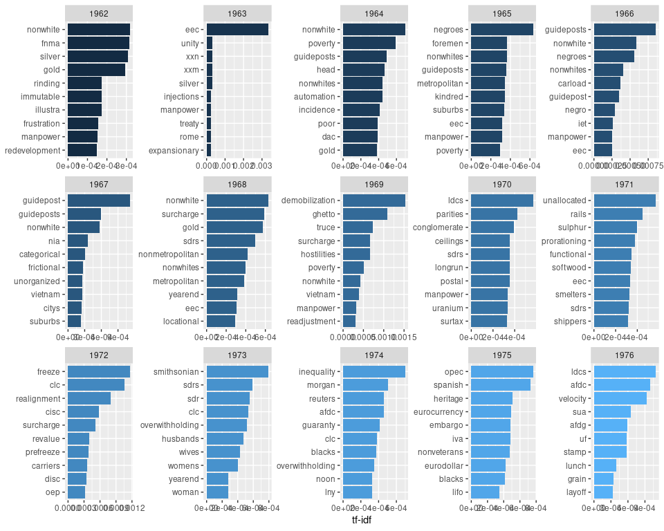
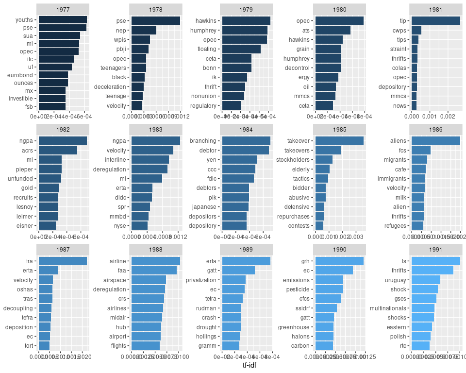

Tf-idf analysis of the economic report of the president
================
Mitsuo Shiota
2020/2/27

  - [Motivation](#motivation)
  - [Libraries](#libraries)
  - [Preparation](#preparation)
      - [Download and split](#download-and-split)
      - [Extract text](#extract-text)
      - [Transform a list of lists into a
        dataframe](#transform-a-list-of-lists-into-a-dataframe)
  - [How many pages in a report?](#how-many-pages-in-a-report)
  - [Tokenize and count most frequently used
    words](#tokenize-and-count-most-frequently-used-words)
  - [tf-idf (term frequency–inverse document frequency)
    analysis](#tf-idf-term-frequencyinverse-document-frequency-analysis)
  - [Top 10 words by year](#top-10-words-by-year)

Updated: 2020-02-27

## Motivation

I have found [“Text Mining Fedspeak” by Len
Kiefer](http://lenkiefer.com/2018/07/28/text-mining-fedspeak/), which
applies tidytext techniques to analyze the annual Federal Reserve
Monetary Policy Report, very interesting. Especially the td-idf analysis
part is fascinating, as it reveals what the Fed is talking abount most
by year. For example, they talked a lot about “iraq”, “war” and “sars”
in 2003, and “subprime” in 2007 and 2008. I could feel the history.

So I use the same techniques to analyze the economic report of the
president from 1947 to 2020.

## Libraries

As usual, I attach tidyverse package. I also attach tidytext package,
which provides text mining techniques.

## Preparation

### Download and split

I download the economic report of the president from 1947 to 2019 from
[FRASER by Federal Reserve Bank of
St. Louis](https://fraser.stlouisfed.org/title/45), and [the
latest 2020 version from the white
house](https://www.whitehouse.gov/wp-content/uploads/2020/02/2020-Economic-Report-of-the-President-WHCEA.pdf)

I first tried to download each pdf into a temporary file, and to extract
text by pdftools::pdf\_text(). But pdftools::pdf\_text() hangs, when it
tries the 2009 report. When I make the 2009 report smaller by excluding
appendixes, pdftools::pdf\_text works. So I changed my strategy. I
download all pdf files in the directory data/before\_split, split them,
and save the files, which exclude appendixes, in the directory
data/after\_split.

I have already downloaded the pdf files by download.py whose codes are
below. I appreciate the digitization works done by the Federal Reserve
Bank of St. Louis. My small complaint is URL inconsistency. Now
before\_split directory size is around 500MB.

``` python
import requests, time

for year in range(1947, 2021):
    if year <= 1949:
        # Although there are midyear reports from 1949 to 1952, I ignore them
        url = 'https://fraser.stlouisfed.org/files/docs/publications/ERP/{0}/ERP_{0}_January.pdf'.format(year)
    elif year <= 1952:
        url = 'https://fraser.stlouisfed.org/files/docs/publications/ERP/{0}/ERP_January_{0}.pdf'.format(year)
    elif year <= 1986:
        url = 'https://fraser.stlouisfed.org/files/docs/publications/ERP/{0}/ERP_{0}.pdf'.format(year)
    elif year <= 1988:
        url = 'https://fraser.stlouisfed.org/files/docs/publications/ERP/{0}/ER_{0}.pdf'.format(year)
    elif year <= 2008:
        url = 'https://fraser.stlouisfed.org/files/docs/publications/ERP/{0}/ERP_{0}.pdf'.format(year)
    elif year == 2009:
        url = 'https://fraser.stlouisfed.org/files/docs/publications/ERP/{0}/{0}_ERP.pdf'.format(year)
    elif year == 2010:
        url = 'https://fraser.stlouisfed.org/files/docs/publications/ERP/{0}/erp_{0}.pdf'.format(year)
    elif year <= 2014:
        url = 'https://fraser.stlouisfed.org/files/docs/publications/ERP/{0}/{0}_erp.pdf'.format(year)
    elif year <= 2019:
        url = 'https://fraser.stlouisfed.org/files/docs/publications/ERP/{}_erp.pdf'.format(year)
    else:
        url = 'https://www.whitehouse.gov/wp-content/uploads/2020/02/2020-Economic-Report-of-the-President-WHCEA.pdf'
    
    output_filename = 'data/before_split/{}_erp.pdf'.format(year)

    myfile = requests.get(url)

    with open(output_filename, 'wb') as out:
        out.write(myfile.content)

    print(year)
    time.sleep(20)
```

Next I manually check which page starts Appendix A, split pdf files, and
save the files which exclude appendixes in the directory
data/after\_split. I have used split.py whose codes are below. Now
after\_split directory size is around 400MB.

``` python
from PyPDF2 import PdfFileReader, PdfFileWriter

def pdf_split(year, app_A_start_page):

    input_filename = 'data/before_split/{}_erp.pdf'.format(year)

    pdf = PdfFileReader(input_filename)

    pdf_writer = PdfFileWriter()

    for page in range(app_A_start_page-1):
        pdf_writer.addPage(pdf.getPage(page))

    output_filename = 'data/after_split/{}_excl_app.pdf'.format(year)

    with open(output_filename, 'wb') as out:
        pdf_writer.write(out)

year = range(1947, 2021)
app_A_start_page = [44, 98, 110,
134, 176, 160, 160, 126, 79, 109, 85, 85, 78,
84, 82, 199, 160, 173, 177,193, 204, 201, 218,
148, 171, 182, 147, 233, 224, 159, 176, 244, 169,
190, 220, 222, 152, 208, 223, 241, 233, 236, 297,
271, 270, 285, 331, 255, 251, 265, 286, 267, 312,
278, 245, 295, 251, 270, 186, 252, 203, 202, 261,
310, 170, 291, 303, 350, 370, 386, 549, 514, 619,
348]

for year, app_A_start_page in zip(year, app_A_start_page):
    pdf_split(year, app_A_start_page)
```

### Extract text

I adapt pdftools::pdf\_text() to each file in the directory
data/after\_split. pdf\_text() returns a text by page in a list. After I
have done all files, I get the list by report, each of which is the list
by page.

``` r
files <- dir("data/after_split", pattern = "\\.pdf$", full.names = TRUE)

erp_list <- vector("list", length = length(files))

for (i in seq_along(erp_list)) {
  erp_list[[i]] <- pdftools::pdf_text(files[i])
  print(files[i])
}
```

    ## [1] "data/after_split/1947_excl_app.pdf"
    ## [1] "data/after_split/1948_excl_app.pdf"
    ## [1] "data/after_split/1949_excl_app.pdf"
    ## [1] "data/after_split/1950_excl_app.pdf"
    ## [1] "data/after_split/1951_excl_app.pdf"
    ## [1] "data/after_split/1952_excl_app.pdf"
    ## [1] "data/after_split/1953_excl_app.pdf"
    ## [1] "data/after_split/1954_excl_app.pdf"
    ## [1] "data/after_split/1955_excl_app.pdf"
    ## [1] "data/after_split/1956_excl_app.pdf"
    ## [1] "data/after_split/1957_excl_app.pdf"
    ## [1] "data/after_split/1958_excl_app.pdf"
    ## [1] "data/after_split/1959_excl_app.pdf"
    ## [1] "data/after_split/1960_excl_app.pdf"
    ## [1] "data/after_split/1961_excl_app.pdf"
    ## [1] "data/after_split/1962_excl_app.pdf"
    ## [1] "data/after_split/1963_excl_app.pdf"
    ## [1] "data/after_split/1964_excl_app.pdf"
    ## [1] "data/after_split/1965_excl_app.pdf"
    ## [1] "data/after_split/1966_excl_app.pdf"
    ## [1] "data/after_split/1967_excl_app.pdf"
    ## [1] "data/after_split/1968_excl_app.pdf"
    ## [1] "data/after_split/1969_excl_app.pdf"
    ## [1] "data/after_split/1970_excl_app.pdf"
    ## [1] "data/after_split/1971_excl_app.pdf"
    ## [1] "data/after_split/1972_excl_app.pdf"
    ## [1] "data/after_split/1973_excl_app.pdf"
    ## [1] "data/after_split/1974_excl_app.pdf"
    ## [1] "data/after_split/1975_excl_app.pdf"
    ## [1] "data/after_split/1976_excl_app.pdf"
    ## [1] "data/after_split/1977_excl_app.pdf"
    ## [1] "data/after_split/1978_excl_app.pdf"
    ## [1] "data/after_split/1979_excl_app.pdf"
    ## [1] "data/after_split/1980_excl_app.pdf"
    ## [1] "data/after_split/1981_excl_app.pdf"
    ## [1] "data/after_split/1982_excl_app.pdf"
    ## [1] "data/after_split/1983_excl_app.pdf"
    ## [1] "data/after_split/1984_excl_app.pdf"
    ## [1] "data/after_split/1985_excl_app.pdf"
    ## [1] "data/after_split/1986_excl_app.pdf"
    ## [1] "data/after_split/1987_excl_app.pdf"
    ## [1] "data/after_split/1988_excl_app.pdf"
    ## [1] "data/after_split/1989_excl_app.pdf"
    ## [1] "data/after_split/1990_excl_app.pdf"
    ## [1] "data/after_split/1991_excl_app.pdf"
    ## [1] "data/after_split/1992_excl_app.pdf"
    ## [1] "data/after_split/1993_excl_app.pdf"
    ## [1] "data/after_split/1994_excl_app.pdf"
    ## [1] "data/after_split/1995_excl_app.pdf"
    ## [1] "data/after_split/1996_excl_app.pdf"
    ## [1] "data/after_split/1997_excl_app.pdf"
    ## [1] "data/after_split/1998_excl_app.pdf"
    ## [1] "data/after_split/1999_excl_app.pdf"
    ## [1] "data/after_split/2000_excl_app.pdf"
    ## [1] "data/after_split/2001_excl_app.pdf"
    ## [1] "data/after_split/2002_excl_app.pdf"
    ## [1] "data/after_split/2003_excl_app.pdf"
    ## [1] "data/after_split/2004_excl_app.pdf"

    ## PDF error (2186832): No current point in closepath
    ## PDF error (2186832): No current point in closepath
    ## PDF error (2186832): No current point in closepath
    ## PDF error (2186832): No current point in closepath
    ## PDF error (2186832): No current point in closepath

    ## PDF error (2186833): No current point in closepath

    ## [1] "data/after_split/2005_excl_app.pdf"
    ## [1] "data/after_split/2006_excl_app.pdf"
    ## [1] "data/after_split/2007_excl_app.pdf"
    ## [1] "data/after_split/2008_excl_app.pdf"
    ## [1] "data/after_split/2009_excl_app.pdf"
    ## [1] "data/after_split/2010_excl_app.pdf"
    ## [1] "data/after_split/2011_excl_app.pdf"
    ## [1] "data/after_split/2012_excl_app.pdf"
    ## [1] "data/after_split/2013_excl_app.pdf"
    ## [1] "data/after_split/2014_excl_app.pdf"
    ## [1] "data/after_split/2015_excl_app.pdf"
    ## [1] "data/after_split/2016_excl_app.pdf"
    ## [1] "data/after_split/2017_excl_app.pdf"
    ## [1] "data/after_split/2018_excl_app.pdf"
    ## [1] "data/after_split/2019_excl_app.pdf"
    ## [1] "data/after_split/2020_excl_app.pdf"

``` r
names(erp_list) <- str_sub(files, 18L, 30L)
```

There may be some pdf problems in the 2005 report. I check like below,
and it looks OK.

``` r
length(erp_list$`2005_excl_app`)
```

    ## [1] 185

``` r
str(erp_list$`2005_excl_app`)
```

    ##  chr [1:185] "Economic Report\r\nof the President\r\nTransmitted to the Congress February 2005\r\n    Together with the Annua"| __truncated__ ...

As the Federal Reserve Bank of St. Louis added some signatures to its
digitization work, I remove them.

``` r
remove_digitized <- function(report) {
  map(report,
      ~ str_remove(.x, "Digitized for FRASER") %>% 
        str_remove("http://fraser.stlouisfed.org/") %>% 
        str_remove("Federal Reserve Bank of St. Louis"))
}

erp_list <- map(erp_list, remove_digitized)
```

I save the list of lists in rdata format. The data size is 14MB.

``` r
save(erp_list, file = "data/erp.rdata")
```

### Transform a list of lists into a dataframe

First I transform a list of lists first into a list of dataframes whose
columns are “text”, “report” and “page.” Next I split text by line, and
add a column, “line.” When I finish every list and bind rows, I get a
dataframe. I replace “report” column with “year” column.

``` r
erp_text_raw <- vector("list", length = length(erp_list))

for (i in seq_along(erp_text_raw)) {
  erp_text_raw[[i]] <- 
    tibble(
      text = unlist(erp_list[[i]]),
      report = names(erp_list)[i],
      page = 1:length(erp_list[[i]])
    ) %>% 
    mutate(text = str_split(text,"\r")) %>% 
    unnest(text) %>% 
    group_by(report, page) %>% 
    mutate(line = row_number()) %>% 
    ungroup() %>% 
    mutate(text = str_remove_all(text, "\n"))
  
}

erp_text_raw_df <- bind_rows(erp_text_raw)

erp_text_raw_df <- erp_text_raw_df %>% 
  mutate(year = as.integer(str_sub(report, 1L, 4L))) %>% 
  select(-report)
```

## How many pages in a report?

The number of pages increased significantly in recent years.

``` r
erp_text_raw_df %>% 
  group_by(year) %>% 
  summarize(n_pages = max(page)) %>% 
  ggplot(aes(year, n_pages)) +
  geom_line()
```

<!-- -->

I check manually which pages are the president part, and not the CEA
(Council of Economic Advisers) part, in each report, and build
data.frame. In 1947-48 and 1954-61, the reports of are not clearly
separated between the president part, “The Economic Report of the
President”, and the CEA part, “The Annual Report of the Council of
Economic Advisers”, so I distinguish by my judegement. Basically I
specify the page of “To the Congress of the United States:” as the start
page of the president part.

The number of pages in the president part has been less than 10 since
1982, which was the first one signed by Reagan.

``` r
pages_pres <- tibble(
  year = 1947:2020,
  start = c(10, 9, 9,
            9, 9, 9, 9, 4, 5, 5, 5, 5, 5,
            5, 5, 11, 11, 11, 9, 9, 9, 9, 9,
            9, 9, 9, 9, 9, 9, 9, 9, 9, 9,
            9, 9, 9, 9, 7, 9, 9, 9, 9, 9,
            9, 9, 9, 9, 9, 4, 7, 9, 9, 9,
            4, 4, 4, 5, 8, 5, 5, 5, 5, 4,
            8, 8, 7, 7, 8, 8, 8, 8, 8, 8,
            8),
  end = c(11, 18, 26,
          25, 33, 39, 35, 6, 8, 8, 9, 8, 9,
          7, 7, 35, 30, 26, 27, 27, 32, 34, 30,
          17, 15, 13, 13, 16, 14, 14, 17, 29, 21,
          21, 25, 16, 14, 13, 15, 17, 14, 16, 17,
          14, 16, 11, 11, 14, 9, 10, 11, 11, 12,
          8, 6, 5, 6, 9, 7, 7, 7, 7, 8,
          14, 12, 9, 9, 11, 11, 11, 11, 16, 11,
          13)
)

pages_pres <- pages_pres %>% 
  mutate(n_pages = end - start + 1)

pages_pres %>% 
  ggplot(aes(year, n_pages)) +
  geom_line()
```

<!-- -->

## Tokenize and count most frequently used words

Now I am ready to utilize tidytext functions. I tokenize texts into
words, remove all words which contain non-alphabetical characters

``` r
erp_text <- erp_text_raw_df %>% 
  unnest_tokens(word, text) %>% 
  mutate(word = str_remove_all(word, "[^A-Za-z ]")) %>%
  filter(word != "")

erp_text
```

    ## # A tibble: 5,856,704 x 4
    ##     page  line  year word       
    ##    <int> <int> <int> <chr>      
    ##  1     1     1  1947 the        
    ##  2     1     1  1947 economic   
    ##  3     1     1  1947 report     
    ##  4     1     2  1947 of         
    ##  5     1     2  1947 the        
    ##  6     1     2  1947 president  
    ##  7     1     3  1947 transmitted
    ##  8     1     3  1947 to         
    ##  9     1     3  1947 the        
    ## 10     1     3  1947 congress   
    ## # ... with 5,856,694 more rows

I count words. The result is uninteresting.

``` r
erp_text  %>%
  count(word, sort = TRUE) 
```

    ## # A tibble: 44,304 x 2
    ##    word       n
    ##    <chr>  <int>
    ##  1 the   384492
    ##  2 of    245785
    ##  3 and   177433
    ##  4 in    172910
    ##  5 to    159196
    ##  6 a      88766
    ##  7 for    67752
    ##  8 that   55180
    ##  9 is     46606
    ## 10 by     41383
    ## # ... with 44,294 more rows

Next I exclude stop words which are “a”, “the”, and something like that.
The result is still boring, as I know the reports are about the economy.

``` r
erp_text  %>%
  anti_join(stop_words, by = "word")%>%
  count(word, sort = TRUE) 
```

    ## # A tibble: 43,658 x 2
    ##    word         n
    ##    <chr>    <int>
    ##  1 percent  30792
    ##  2 economic 22676
    ##  3 growth   21294
    ##  4 rate     18249
    ##  5 income   16114
    ##  6 tax      15853
    ##  7 federal  13145
    ##  8 rates    12383
    ##  9 labor    12155
    ## 10 prices   12052
    ## # ... with 43,648 more rows

## tf-idf (term frequency–inverse document frequency) analysis

So I turn to tf-idf analysis, which scores high the words which appear
frequently in this year’s report, but seldom appear in the other years’
reports.

The highest score goes to “opioids” in 2020. The high score of “https”
is due to richer references in recent reports.

``` r
erp_textb <- erp_text %>% 
  count(year, word, sort = TRUE) %>% 
  bind_tf_idf(word, year, n) %>%
  arrange(desc(tf_idf))

erp_textb
```

    ## # A tibble: 450,492 x 6
    ##     year word              n      tf   idf  tf_idf
    ##    <int> <chr>         <int>   <dbl> <dbl>   <dbl>
    ##  1  2020 opioids         330 0.00278  3.21 0.00891
    ##  2  2020 opioid          320 0.00270  3.21 0.00864
    ##  3  2018 cyber           402 0.00223  3.21 0.00715
    ##  4  2020 https           276 0.00233  2.22 0.00517
    ##  5  2019 https           415 0.00182  2.22 0.00405
    ##  6  2018 https           316 0.00175  2.22 0.00390
    ##  7  2016 cea             299 0.00247  1.53 0.00379
    ##  8  2005 hiv             104 0.00161  2.22 0.00359
    ##  9  2018 cybersecurity   274 0.00152  2.36 0.00359
    ## 10  1985 takeover         99 0.00122  2.92 0.00356
    ## # ... with 450,482 more rows

## Top 10 words by year

Next I would like to show top 10 words by year. I tried several times,
and somewhat arbitrarily picked custom stop words. I prepare the plot
function for drawing.

``` r
custom_stop_words <- 
  bind_rows(tibble(word = c("gdp",
                            "gnp",
                            "box",
                            "cea",
                            "ceas",
                            "yr",
                            "fy"),
                   lexicon = c("custom")), 
            stop_words)

plot_tf_idf <- function(year_start, year_end) {
  erp_textb %>% 
    filter(year >= year_start, year <= year_end) %>% 
    anti_join(custom_stop_words, by="word") %>%
    mutate(word = factor(word, levels = rev(unique(word)))) %>% 
    group_by(year) %>% 
    top_n(10, tf_idf) %>% 
    ungroup() %>% 
    ggplot(aes(word, tf_idf, fill = year)) +
    geom_col(show.legend = FALSE) +
    labs(x = NULL, y = "tf-idf") +
    facet_wrap(~ year, scales = "free", ncol = 5) +
    coord_flip()
}
```

Digitization is not perfect. When I search “inn” in 1956, I find
some axis parts of charts as “inn”. So, you may see
some strange words below. Also, be aware that the scale of the tf-idf
axis is not the same across years.

Anyway, can’t you feel the history?

I found “japanese” in 1984, read the report, and found the report
complained a lot about the undervalued japanese yen. The report seems to
have been the prelude to the Plaza Accord of 1985. That is a history, or
is it?

``` r
plot_tf_idf(1947, 1961)
```

<!-- -->

``` r
plot_tf_idf(1962, 1976)
```

<!-- -->

``` r
plot_tf_idf(1977, 1991)
```

<!-- -->

``` r
plot_tf_idf(1992, 2006)
```

<!-- -->

``` r
plot_tf_idf(2007, 2020)
```

<!-- -->

EOL
