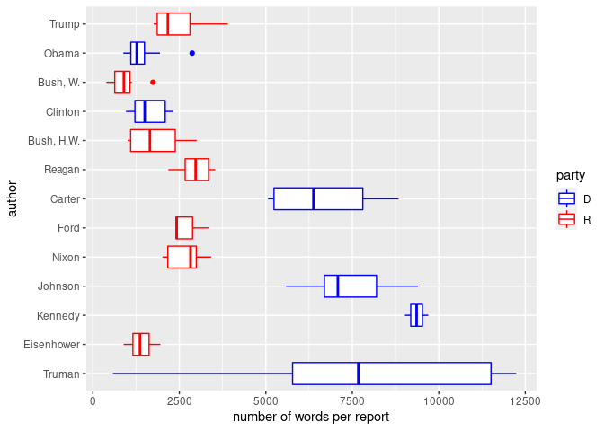
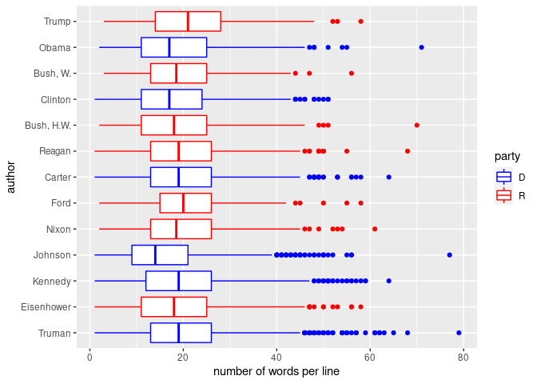
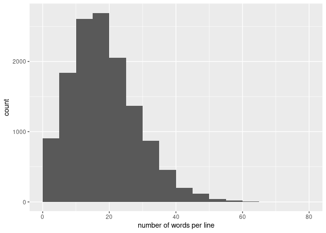

Sentiment analysis of the economic report of the president
================
Mitsuo Shiota
2020/3/2

  - [Motivation](#motivation)
  - [Prepare cleaned-up texts and tidytext
    data](#prepare-cleaned-up-texts-and-tidytext-data)
  - [Whose talks are more verbose?](#whose-talks-are-more-verbose)
  - [Check sentimental words by
    bigram](#check-sentimental-words-by-bigram)
  - [Sentiment analysis](#sentiment-analysis)

Updated: 2020-07-14

## Motivation

After I have done [td-idf
analysis](https://github.com/mitsuoxv/erp/blob/master/README.md), I
would like to do sentiment analysis of the economic report of the
president. Basically, I follow the codes in [“Text Mining Fedspeak” by
Len Kiefer](http://lenkiefer.com/2018/07/28/text-mining-fedspeak/).

## Prepare cleaned-up texts and tidytext data

The files in `texts/presidents/`, such as `1947_pres.txt`, are the
president parts which I have manually cleaned up. I will do sentiment
analysis to the president part, not including the Council of Economic
Advisers part.

I cleaned up by:

1.  correcting word order, where digitization made mistakes in shaping
    lines;

2.  correcting words, where optical recognition made mistakes due to
    dirt, or the author apparently misspelled;

3.  making punctuation common over reports, following my memory of [“The
    Mac is Not a Typewriter” by Robin P.
    Williams](https://www.goodreads.com/book/show/41600.The_Mac_is_Not_a_Typewriter),
    which I must have, but could not find now. As an exception, using
    minus mark instead of hyphen; and

4.  changing lines, where I encounter “;”, “:”, “—” or “,” and when I
    feel changed lines are natural if they were in President Johnson’s
    reports.

I tried to be consistent over reports of different authors. Honestly, I
am not sure whether “text” has become more consistent or not, as a
result.

To refresh memory, I show some variables below.

erp\_text\_raw\_df is a data frame consisted of 3 colums: “year”, “line”
and “text”. “text” is basically a sentence, but in some cases, it is a
clause.

``` r
erp_text_df
```

    ## # A tibble: 13,106 x 3
    ##    text                                                               year  line
    ##    <chr>                                                             <int> <int>
    ##  1 To the Congress of the United States:                              1947     1
    ##  2 As the year 1947 opens America has never been so strong or so pr…  1947     2
    ##  3 Nor have our prospects ever been brighter.                         1947     3
    ##  4 Yet in the minds of a great many of us there is a fear of anothe…  1947     4
    ##  5 But America was not built on fear.                                 1947     5
    ##  6 America was built on courage, on imagination and an unbeatable d…  1947     6
    ##  7 The job at hand today is to see to it that America is not ravage…  1947     7
    ##  8 Nor is prosperity in the United States important to the American…  1947     8
    ##  9 It is the foundation of world prosperity and world peace.          1947     9
    ## 10 And the world is looking to us.                                    1947    10
    ## # … with 13,096 more rows

erp\_text is a data frame after “text” was tokenized into “word”. It has
3 colums: “year”, “line”, “word”.

``` r
erp_text
```

    ## # A tibble: 248,141 x 3
    ##     year  line word    
    ##    <int> <int> <chr>   
    ##  1  1947     1 to      
    ##  2  1947     1 the     
    ##  3  1947     1 congress
    ##  4  1947     1 of      
    ##  5  1947     1 the     
    ##  6  1947     1 united  
    ##  7  1947     1 states  
    ##  8  1947     2 as      
    ##  9  1947     2 the     
    ## 10  1947     2 year    
    ## # … with 248,131 more rows

## Whose talks are more verbose?

Old Democrats tend to write more lines and words in a report.

<!-- -->

<!-- -->

The number of words per line does not vary much among the Presidents,
partly because I have somewhat arbitrarily changed lines by trying to be
consistent over different authors.

<!-- -->

Distribution concentrates from 5 to 34 words per line.

<!-- -->

President Johnson wrote the most lines in his 8 reports. The second is
Truman in his 7 reports, and the third is Carter in his 4 reports. My
attempt to [let the presidents
speak](https://github.com/mitsuoxv/erp/blob/master/let_pres_speak.ipynb)
is biased to old Democrats.

<!-- -->

## Check sentimental words by bigram

I use “bing” to get sentimental words, which show either “positive” or
“negative”. Among the sentimental words, “benefits” appear most in the
president part of the economic report of the president.

``` r
sentiment_word_rank <- erp_text %>%
  inner_join(get_sentiments("bing"), by = "word") %>%
  count(word, sentiment, sort = TRUE) %>% 
  mutate(rank = rank(desc(n), ties.method = "random"))

sentiment_word_rank
```

    ## # A tibble: 1,533 x 4
    ##    word       sentiment     n  rank
    ##    <chr>      <chr>     <int> <int>
    ##  1 work       positive    344     1
    ##  2 free       positive    273     2
    ##  3 progress   positive    249     3
    ##  4 prosperity positive    229     4
    ##  5 problems   negative    228     5
    ##  6 important  positive    227     6
    ##  7 support    positive    217     7
    ##  8 strong     positive    210     8
    ##  9 well       positive    206     9
    ## 10 better     positive    190    11
    ## # … with 1,523 more rows

Some of sentimental words in “bing” are just technical terms in economic
reports. “debt” is such an example.

“gross” is likely to be a part of technical terms, like “gross domestic
product”. Thus Len Kiefer suspects in [“Text Mining
Fedspeak”](http://lenkiefer.com/2018/07/28/text-mining-fedspeak/).

I suspect “benefits” is another example, as it appears in the technical
terms like “social benefits”.

``` r
sentiment_word_rank %>% 
  filter(word == "gross")
```

    ## # A tibble: 1 x 4
    ##   word  sentiment     n  rank
    ##   <chr> <chr>     <int> <int>
    ## 1 gross negative     60    58

``` r
sentiment_word_rank %>% 
  filter(word == "benefits")
```

    ## # A tibble: 1 x 4
    ##   word     sentiment     n  rank
    ##   <chr>    <chr>     <int> <int>
    ## 1 benefits positive    177    12

Let’s check Len Kiefer’s and my suspicion. I go back to erp\_text\_df,
and tokenize “text” not by a single word into “word”, but by 2
consecutive words into “bigram” this time. Then I get erp\_bigrams,
which is a data frame of 4 colums: “year”, “page”, “line” and “bigram”.

``` r
erp_bigrams <-   
  erp_text_df %>%
  unnest_tokens(bigram, text, token = "ngrams", n = 2) %>% 
  drop_na(bigram)

erp_bigrams
```

    ## # A tibble: 235,035 x 3
    ##     year  line bigram       
    ##    <int> <int> <chr>        
    ##  1  1947     1 to the       
    ##  2  1947     1 the congress 
    ##  3  1947     1 congress of  
    ##  4  1947     1 of the       
    ##  5  1947     1 the united   
    ##  6  1947     1 united states
    ##  7  1947     2 as the       
    ##  8  1947     2 the year     
    ##  9  1947     2 year 1947    
    ## 10  1947     2 1947 opens   
    ## # … with 235,025 more rows

Most frequently used bigrams are uninteresting, as they include stop
words.

``` r
erp_bigrams %>%
  count(bigram, sort = TRUE)
```

    ## # A tibble: 87,730 x 2
    ##    bigram           n
    ##    <chr>        <int>
    ##  1 of the        2135
    ##  2 in the        1630
    ##  3 to the         807
    ##  4 of our         663
    ##  5 and the        544
    ##  6 for the        516
    ##  7 the congress   437
    ##  8 we have        420
    ##  9 we must        417
    ## 10 the economy    342
    ## # … with 87,720 more rows

So I separate “bigram” into “word1” and “word2”, and filter so that
either “word1” or “word2” is not a stop word. After filtering, most
frequently used bigrams are “labor force”, etc. They show these reports
are indeed about the economy.

``` r
bigrams_separated <- erp_bigrams %>%
  separate(bigram, c("word1", "word2"), sep = " ")

bigrams_filtered <- bigrams_separated %>%
  filter(!word1 %in% stop_words$word) %>%
  filter(!word2 %in% stop_words$word)

bigrams_filtered %>% 
  count(word1, word2, sort = TRUE)
```

    ## # A tibble: 23,793 x 3
    ##    word1    word2          n
    ##    <chr>    <chr>      <int>
    ##  1 economic growth       273
    ##  2 federal  government   149
    ##  3 billion  dollars      141
    ##  4 american people       122
    ##  5 1        2            108
    ##  6 price    stability     99
    ##  7 social   security      92
    ##  8 private  sector        91
    ##  9 american economy       89
    ## 10 labor    force         84
    ## # … with 23,783 more rows

What word follows “gross” most frequently? As Len Kiefer suspects,
“gross” is a part of technical terms, and should not be included in
the sentimental words.

``` r
bigrams_filtered %>%
  filter(word1 == "gross") %>%
  count(word2, sort = TRUE)
```

    ## # A tibble: 6 x 2
    ##   word2          n
    ##   <chr>      <int>
    ## 1 national      48
    ## 2 domestic       8
    ## 3 debt           1
    ## 4 investment     1
    ## 5 private        1
    ## 6 stock          1

What word precedes “benefits” most frequently? My suspicion is
confirmed.

``` r
bigrams_filtered %>%
  filter(word2 == "benefits") %>%
  count(word1, sort = TRUE)
```

    ## # A tibble: 50 x 2
    ##    word1            n
    ##    <chr>        <int>
    ##  1 security        10
    ##  2 extended         5
    ##  3 insurance        4
    ##  4 economic         3
    ##  5 unemployment     3
    ##  6 cash             2
    ##  7 enormous         2
    ##  8 fringe           2
    ##  9 increased        2
    ## 10 receiving        2
    ## # … with 40 more rows

So I add “benefits” to the stop words prepared by Len Kiefer in [“Text
Mining
Fedspeak”](http://lenkiefer.com/2018/07/28/text-mining-fedspeak/).

``` r
custom_stop_words2 <- 
  bind_rows(tibble(word = c("benefits",
                            "debt",
                            "gross",
                            "crude",
                            "well",
                            "maturity",
                            "work",
                            "marginally",
                            "leverage"),
                   lexicon = c("custom")),
            stop_words)
```

## Sentiment analysis

I count both positive and negative words, and take the difference as
“sentiment”. I draw “sentiment” by year. Looks like the presidents
before 1970 were optimistic. But wait.

``` r
erp_text %>%
  anti_join(custom_stop_words2, by = "word") %>%
  inner_join(get_sentiments("bing"), by = "word") %>%
  count(year, sentiment) %>%
  spread(sentiment, n, fill = 0) %>% 
  mutate(sentiment = positive - negative) %>% 
  ggplot(aes(year, sentiment)) +
  geom_line()
```

<!-- -->

As I count the number of words, “sentiment” gets bigger either in
positive or negative direction, as the number of words increase. So I
decide to standardize by the number of words excluding stop words. First
I count the number of words excluding stop words by year.

``` r
erp_words <-
  erp_text %>%
  anti_join(custom_stop_words2, by = "word") %>% 
  group_by(year) %>% 
  count()
```

I prepare to draw shaded areas of recession. I owe this technique also
to Len Kiefer, as I refer to his [“Plotting U.S. Macroeconomic Trends
with FRED and
R”](http://lenkiefer.com/2017/12/11/plotting-u-s-macroeconomic-trends-with-fred-and-r/).

``` r
recessions_df = read.table(textConnection(
  "Peak, Trough
  1948-11-01, 1949-10-01
  1953-07-01, 1954-05-01
  1957-08-01, 1958-04-01
  1960-04-01, 1961-02-01
  1969-12-01, 1970-11-01
  1973-11-01, 1975-03-01
  1980-01-01, 1980-07-01
  1981-07-01, 1982-11-01
  1990-07-01, 1991-03-01
  2001-03-01, 2001-11-01
  2007-12-01, 2009-06-01"), sep=',',
  colClasses=c('Date', 'Date'), header=TRUE)
```

As the reports were mostly published in January or February of each
year, I put the points in February in each year. The shaded areas are
recessions. The sentiments tend to fall after the recession, but not
always.

``` r
erp_text %>%
  anti_join(custom_stop_words2, by = "word") %>%
  inner_join(get_sentiments("bing"), by = "word") %>%
  count(year, sentiment) %>%
  spread(sentiment, n, fill = 0) %>%
  left_join(erp_words, by = "year") %>% 
  mutate(sentiment = (positive - negative) / n) %>% 
  mutate(publish = as.Date(str_c(year, "-02-01"))) %>% 
  ggplot(aes(publish, sentiment)) +
  geom_hline(yintercept = 0, color = "white", size = 2) +
  geom_rect(data = recessions_df, inherit.aes = FALSE,
            aes(xmin = Peak, xmax = Trough, ymin = -Inf, ymax = +Inf),
            fill='darkgray', alpha=0.5) +
  geom_line() +
  xlab(NULL)
```

<!-- -->

EOL
