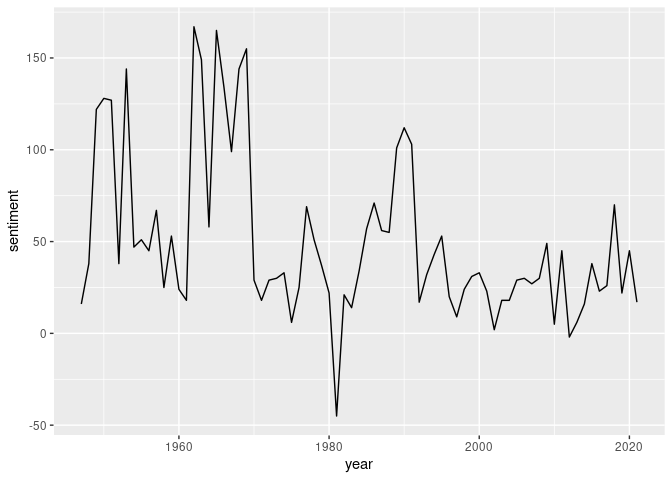
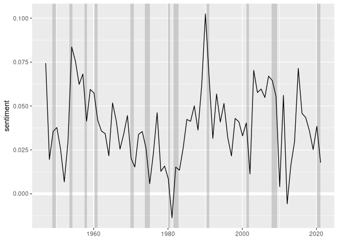

Sentiment analysis of the economic report of the president
================
Mitsuo Shiota
2020/3/2

  - [Motivation](#motivation)
  - [Prepare cleaned-up texts and tidytext
    data](#prepare-cleaned-up-texts-and-tidytext-data)
  - [Check sentimental words by
    bigram](#check-sentimental-words-by-bigram)
  - [Sentiment analysis of the president
    part](#sentiment-analysis-of-the-president-part)

Updated: 2020-03-02

## Motivation

After I have done [td-idf
analysis](https://github.com/mitsuoxv/erp/blob/master/README.md), I
would like to do sentiment analysis of the economic report of the
president. Basically, I follow the codes in [“Text Mining Fedspeak” by
Len Kiefer](http://lenkiefer.com/2018/07/28/text-mining-fedspeak/).

## Prepare cleaned-up texts and tidytext data

To refresh memory, I show some variables below.

erp\_text\_raw\_df is a data frame consisted of 4 colums: “year”,
“page”, “line”, “text”. “text” is not yet tidy.

``` r
erp_text_raw_df
```

    ## # A tibble: 696,915 x 4
    ##    text                                                         page  line  year
    ##    <chr>                                                       <int> <int> <int>
    ##  1 "                              The Economic Report"             1     1  1947
    ##  2 "                                  of the President"            1     2  1947
    ##  3 "                              TRANSMITTED TO THE CONGRESS"     1     3  1947
    ##  4 "                                     January 8, 1947"          1     4  1947
    ##  5 ""                                                              1     5  1947
    ##  6 ""                                                              1     6  1947
    ##  7 ""                                                              1     7  1947
    ##  8 ""                                                              1     8  1947
    ##  9 ""                                                              2     1  1947
    ## 10 ""                                                              2     2  1947
    ## # ... with 696,905 more rows

erp\_text is a data frame after “text” was tokenized into “word”. It has
4 colums: “year”, “page”, “line”, “word”.

``` r
erp_text
```

    ## # A tibble: 5,856,704 x 4
    ##     page  line  year word       
    ##    <int> <int> <int> <chr>      
    ##  1     1     1  1947 the        
    ##  2     1     1  1947 economic   
    ##  3     1     1  1947 report     
    ##  4     1     2  1947 of         
    ##  5     1     2  1947 the        
    ##  6     1     2  1947 president  
    ##  7     1     3  1947 transmitted
    ##  8     1     3  1947 to         
    ##  9     1     3  1947 the        
    ## 10     1     3  1947 congress   
    ## # ... with 5,856,694 more rows

pages\_pres is a data frame to show the page in which the president part
starts and ends. It has 4 colums: “year”, “start”, “end”, “n\_pages”. I
will do sentiment analysis only for this president part.

``` r
pages_pres
```

    ## # A tibble: 74 x 4
    ##     year start   end n_pages
    ##    <int> <dbl> <dbl>   <dbl>
    ##  1  1947    10    11       2
    ##  2  1948     9    18      10
    ##  3  1949     9    26      18
    ##  4  1950     9    25      17
    ##  5  1951     9    33      25
    ##  6  1952     9    39      31
    ##  7  1953     9    35      27
    ##  8  1954     4     6       3
    ##  9  1955     5     8       4
    ## 10  1956     5     8       4
    ## # ... with 64 more rows

## Check sentimental words by bigram

I use “bing” to get sentimental words, which show either “positive” or
“negative”. Among the sentimental words, “benefits” appear most in the
president part of the economic report of the president.

``` r
sentiment_word_rank <- erp_text %>%
  inner_join(get_sentiments("bing"), by = "word") %>%
  count(word, sentiment, sort = TRUE) %>% 
  mutate(rank = rank(desc(n), ties.method = "random"))

sentiment_word_rank
```

    ## # A tibble: 3,134 x 4
    ##    word      sentiment     n  rank
    ##    <chr>     <chr>     <int> <int>
    ##  1 benefits  positive   6590     1
    ##  2 important positive   5556     2
    ##  3 work      positive   5457     3
    ##  4 well      positive   5319     4
    ##  5 decline   negative   4427     5
    ##  6 debt      negative   3373     6
    ##  7 support   positive   3135     7
    ##  8 recovery  positive   3115     8
    ##  9 available positive   3063     9
    ## 10 poverty   negative   3012    10
    ## # ... with 3,124 more rows

Some of sentimental words in “bing” are just technical terms in economic
reports. “debt” is such an example.

“gross” ranks 26, but it is likely to be a part of technical terms, like
“gross domestic product”. Thus Len Kiefer suspects in [“Text Mining
Fedspeak”](http://lenkiefer.com/2018/07/28/text-mining-fedspeak/).

I suspect “benefits” is another example, as it appears in the technical
terms like “social benefits”.

``` r
sentiment_word_rank %>% 
  filter(word == "gross")
```

    ## # A tibble: 1 x 4
    ##   word  sentiment     n  rank
    ##   <chr> <chr>     <int> <int>
    ## 1 gross negative   2022    26

Let’s check Len Kiefer’s and my suspicion. I go back to
erp\_text\_raw\_df, and tokenize “text” not by a single word into
“word”, but by 2 consecutive words into “bigram” this time. Then I
get erp\_bigrams, which is a data frame of 4 colums: “year”, “page”,
“line” and “bigram”.

``` r
erp_bigrams <-   
  erp_text_raw_df %>%
  unnest_tokens(bigram, text, token = "ngrams", n = 2) %>% 
  drop_na(bigram)

erp_bigrams
```

    ## # A tibble: 5,573,938 x 4
    ##     page  line  year bigram         
    ##    <int> <int> <int> <chr>          
    ##  1     1     1  1947 the economic   
    ##  2     1     1  1947 economic report
    ##  3     1     1  1948 the economic   
    ##  4     1     1  1948 economic report
    ##  5     1     1  1949 the economic   
    ##  6     1     1  1949 economic report
    ##  7     1     1  1950 he economic    
    ##  8     1     1  1950 economic report
    ##  9     1     1  1951 the economic   
    ## 10     1     1  1951 economic report
    ## # ... with 5,573,928 more rows

Most frequently used bigrams are uninteresting, as they include stop
words.

``` r
erp_bigrams %>%
  count(bigram, sort = TRUE)
```

    ## # A tibble: 1,079,408 x 2
    ##    bigram            n
    ##    <chr>         <int>
    ##  1 of the        49200
    ##  2 in the        43634
    ##  3 to the        15051
    ##  4 and the       13362
    ##  5 united states  9088
    ##  6 for the        9050
    ##  7 the united     8871
    ##  8 by the         8731
    ##  9 on the         8616
    ## 10 percent of     7320
    ## # ... with 1,079,398 more rows

So I separate “bigram” into “word1” and “word2”, and filter so that
either “word1” or “word2” is not a stop word. After filtering, most
frequently used bigrams are “labor force”, etc. They show these reports
are indeed about the economy.

``` r
bigrams_separated <- erp_bigrams %>%
  separate(bigram, c("word1", "word2"), sep = " ")

bigrams_filtered <- bigrams_separated %>%
  filter(!word1 %in% stop_words$word) %>%
  filter(!word2 %in% stop_words$word)

bigrams_filtered %>% 
  count(word1, word2, sort = TRUE)
```

    ## # A tibble: 523,138 x 3
    ##    word1        word2        n
    ##    <chr>        <chr>    <int>
    ##  1 labor        force     3198
    ##  2 health       care      2528
    ##  3 economic     growth    2442
    ##  4 economic     report    2044
    ##  5 unemployment rate      1905
    ##  6 1            1         1856
    ##  7 social       security  1838
    ##  8 federal      reserve   1784
    ##  9 annual       rate      1777
    ## 10 labor        market    1771
    ## # ... with 523,128 more rows

What word follows “gross” most frequently? As Len Kiefer suspects,
“gross” is a part of technical terms, and should not be included in
the sentimental words.

``` r
bigrams_filtered %>%
  filter(word1 == "gross") %>%
  count(word2, sort = TRUE)
```

    ## # A tibble: 172 x 2
    ##    word2          n
    ##    <chr>      <int>
    ##  1 national     644
    ##  2 domestic     304
    ##  3 private      129
    ##  4 investment   108
    ##  5 income        50
    ##  6 saving        49
    ##  7 job           39
    ##  8 product       38
    ##  9 farm          23
    ## 10 business      21
    ## # ... with 162 more rows

What word precedes “benefits” most frequently? My suspicion is
confirmed.

``` r
bigrams_filtered %>%
  filter(word2 == "benefits") %>%
  count(word1, sort = TRUE)
```

    ## # A tibble: 674 x 2
    ##    word1            n
    ##    <chr>        <int>
    ##  1 security       203
    ##  2 economic       195
    ##  3 fringe         113
    ##  4 health         113
    ##  5 insurance       97
    ##  6 unemployment    96
    ##  7 net             84
    ##  8 retirement      69
    ##  9 ui              63
    ## 10 social          62
    ## # ... with 664 more rows

So I add “benefits” to the stop words prepared by Len Kiefer in [“Text
Mining
Fedspeak”](http://lenkiefer.com/2018/07/28/text-mining-fedspeak/).

``` r
custom_stop_words2 <- 
  bind_rows(tibble(word = c("benefits",
                            "debt",
                            "gross",
                            "crude",
                            "well",
                            "maturity",
                            "work",
                            "marginally",
                            "leverage"),
                   lexicon = c("custom")),
            stop_words)
```

## Sentiment analysis of the president part

I will do sentiment analysis to the president part, not including the
Council of Economic Advisers part. So I first get the president part.

``` r
erp_text_pres <- erp_text %>% 
  left_join(pages_pres, by = "year") %>% 
  filter(page >= start, page <= end)
```

Next I count both positive and negative words, and take the difference
as “sentiment”. I draw “sentiment” by year. Looks like the presidents
before 1970 were optimistic. But wait.

``` r
erp_text_pres %>%
  anti_join(custom_stop_words2, by = "word") %>%
  inner_join(get_sentiments("bing"), by = "word") %>%
  count(year, sentiment) %>%
  spread(sentiment, n, fill = 0) %>% 
  mutate(sentiment = positive - negative) %>% 
  ggplot(aes(year, sentiment)) +
  geom_line()
```

<!-- -->

As I count the number of words, “sentiment” gets bigger either in
positive or negative direction, as the number of words increase. As I
drawed in [td-idf
analysis](https://github.com/mitsuoxv/erp/blob/master/README.md), the
number of pages before Reagan was usually large.

``` r
pages_pres %>% 
  ggplot(aes(year, n_pages)) +
  geom_hline(yintercept = 0, color = "white", size = 2) +
  geom_line()
```

<!-- -->

So I decide to standardize by the number of words excluding stop words.
First I count the number of words excluding stop words by year.

``` r
erp_words <-
  erp_text_pres %>%
  anti_join(custom_stop_words2, by = "word") %>% 
  group_by(year) %>% 
  count()
```

I prepare to draw shaded areas of recession. I owe this technique also
to Len Kiefer, as I refer to his [“Plotting U.S. Macroeconomic Trends
with FRED and
R”](http://lenkiefer.com/2017/12/11/plotting-u-s-macroeconomic-trends-with-fred-and-r/).

``` r
recessions_df = read.table(textConnection(
  "Peak, Trough
  1948-11-01, 1949-10-01
  1953-07-01, 1954-05-01
  1957-08-01, 1958-04-01
  1960-04-01, 1961-02-01
  1969-12-01, 1970-11-01
  1973-11-01, 1975-03-01
  1980-01-01, 1980-07-01
  1981-07-01, 1982-11-01
  1990-07-01, 1991-03-01
  2001-03-01, 2001-11-01
  2007-12-01, 2009-06-01"), sep=',',
  colClasses=c('Date', 'Date'), header=TRUE)
```

As the reports were mostly published in January or February of each
year, I put the points in February in each year. The shaded areas are
recessions. The sentiments tend to fall after the recession, but not
always.

``` r
erp_text_pres %>%
  anti_join(custom_stop_words2, by = "word") %>%
  inner_join(get_sentiments("bing"), by = "word") %>%
  count(year, sentiment) %>%
  spread(sentiment, n, fill = 0) %>%
  left_join(erp_words, by = "year") %>% 
  mutate(sentiment = (positive - negative) / n) %>% 
  mutate(publish = as.Date(str_c(year, "-02-01"))) %>% 
  ggplot(aes(publish, sentiment)) +
  geom_hline(yintercept = 0, color = "white", size = 2) +
  geom_rect(data = recessions_df, inherit.aes = FALSE,
            aes(xmin = Peak, xmax = Trough, ymin = -Inf, ymax = +Inf),
            fill='darkgray', alpha=0.5) +
  geom_line() +
  labs(x = "")
```

<!-- -->

EOL
